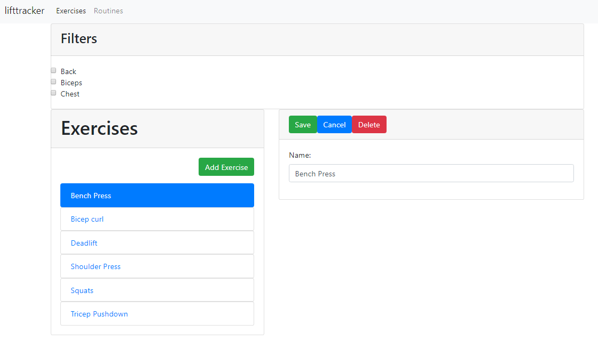

## About

This app allows you to record your gym routines, specifically geared towards lifting weights.
The app allows you to define exercises, and then create routines with reps and sets.

This is a PoC app to demonstrate the following technologies working together:
* Spring Boot
* Angular 2+
* NGRX state management
* MySQL
* Bootstrap 4

This is the front-end part of the application.

Please see the back-end repo as well:
https://github.com/yus-h/lifttracker-backend

## Setup

### MySQL

A local mySQL should be setup. Once setup, please configure the 
credentials in the application.properties files in the back-end.

## To run the application:

1. Backend
  - mvn spring-boot:run
2. Frontend:
  - npm install
  - ng serve
3. Navigate to localhost:4200

## Other Notes

### User Account

Navigate to localhost:4200/signup and specify a username/password to create an account.

Once you have logged in, you will be able to create and modify your routine

### TODO

* Correct authentication
* Create exercise by muscle group and more complex data structure for exercise (e.g. photos etc)
* Refactor remainder of app with NGRX
* Routine stats visualisation with d3

## Screenshots

